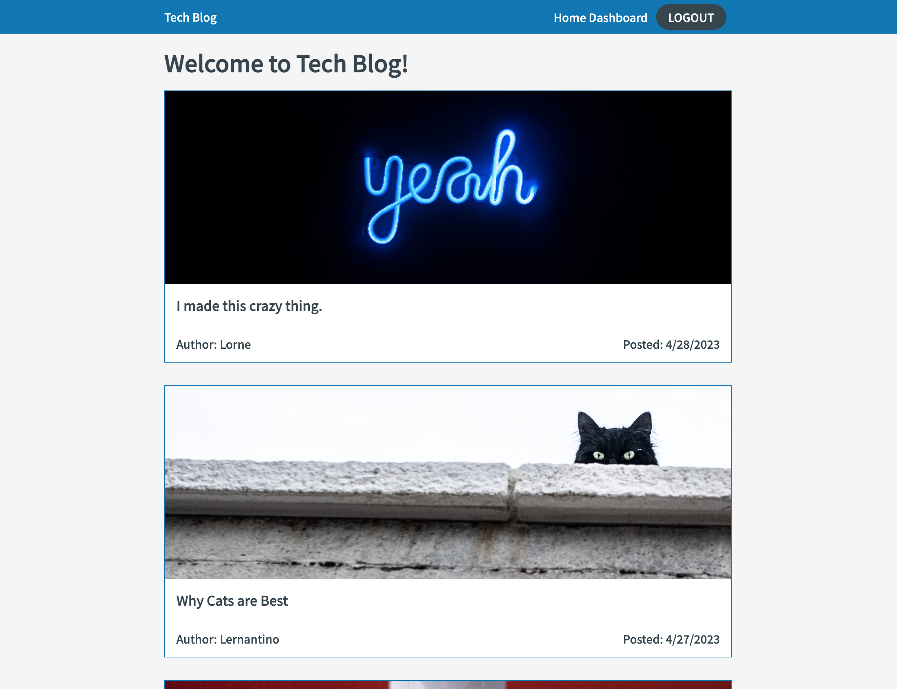

# Tech Blog

## Description

A full stack blog application that allows users to create an account, create posts, comment on posts, and view other users posts. The application uses the MVC design pattern and is built using Node.js, Express.js, MySQL, and Handlebars.js. The application is deployed to heroku and can be accessed [here](https://tech-blog-9845784.herokuapp.com/).

## Table of Contents

- [Installation](#installation)
- [Usage](#usage)
- [Credits](#credits)
- [License](#license)

## Installation

Requirements:

- Node v18.x
- MySQL Server

Instructions:

- clone this repo.
- cd into project directory
- npm install
- update MySQL database connection configuration in `./config/connection.js` and create your database.
- `npm run start`
- the default url is `http://localhost:3001/`

Note: If you'd like to seed the database with some test data, run `npm run seed` after creating the database.

## Usage

All posts are visible on the home page. 

To create a post you must first log in or sign up. Click `Login` in the top nav to load the login/signup page enter your details and log in. 

Click dashboard in the top nav to view your posts. Click `New Post` to create a new post.

If you load a post you authored yourself you will see a `Delete Post` and `Update Post` button. Clicking `Delete Post` will delete the post. Clicking `Update Post` will load the update post page where you can update the post title, image and body.

## License

MIT License Copyright (c) 2023 Lorne Cyr

## Badges

